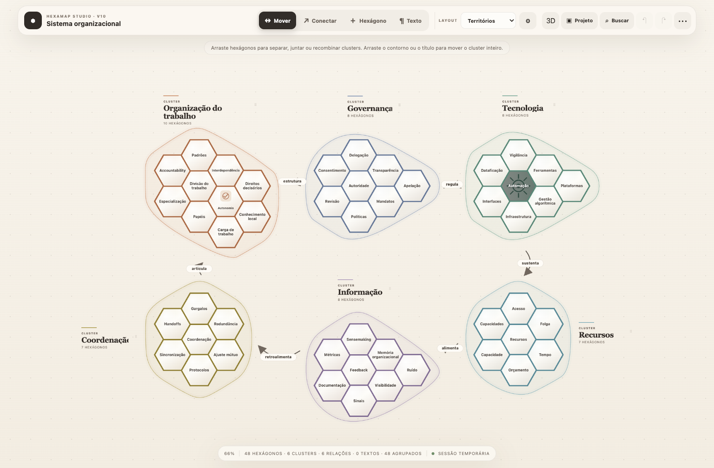
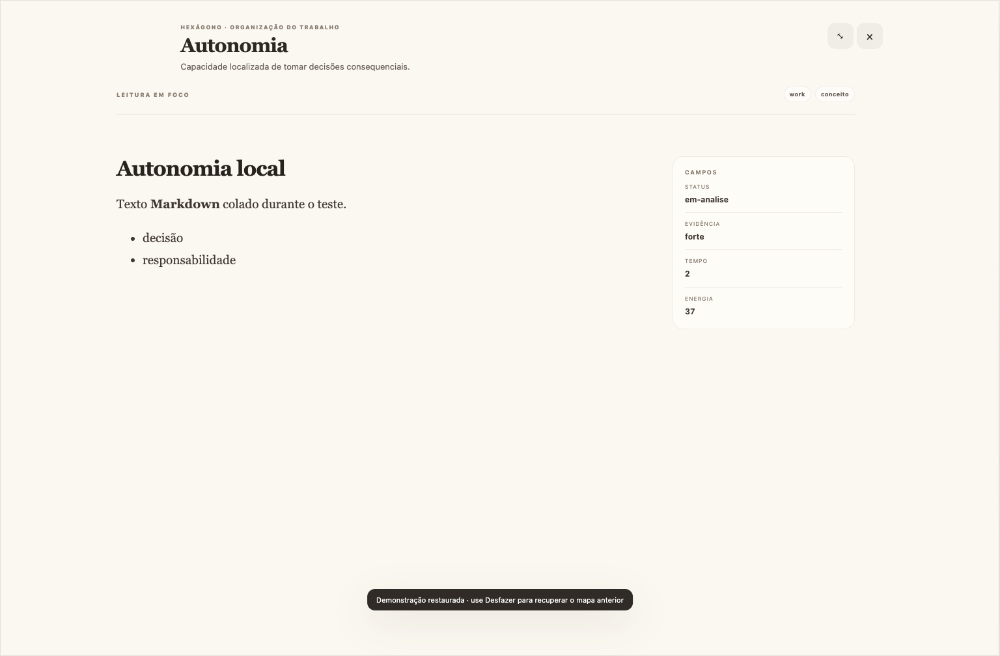
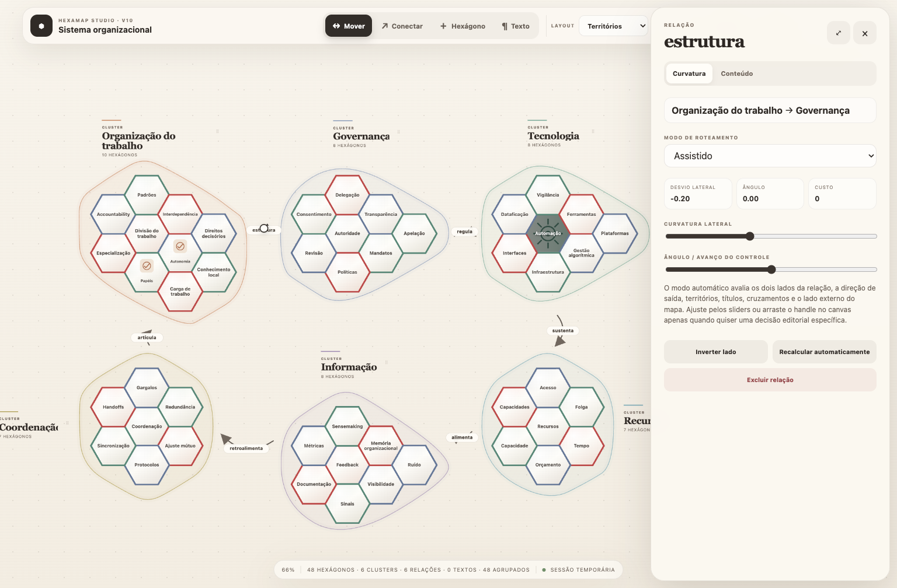
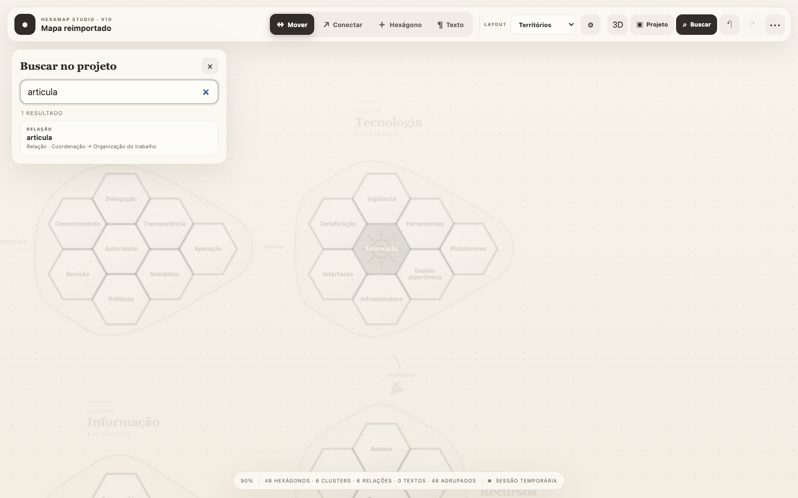
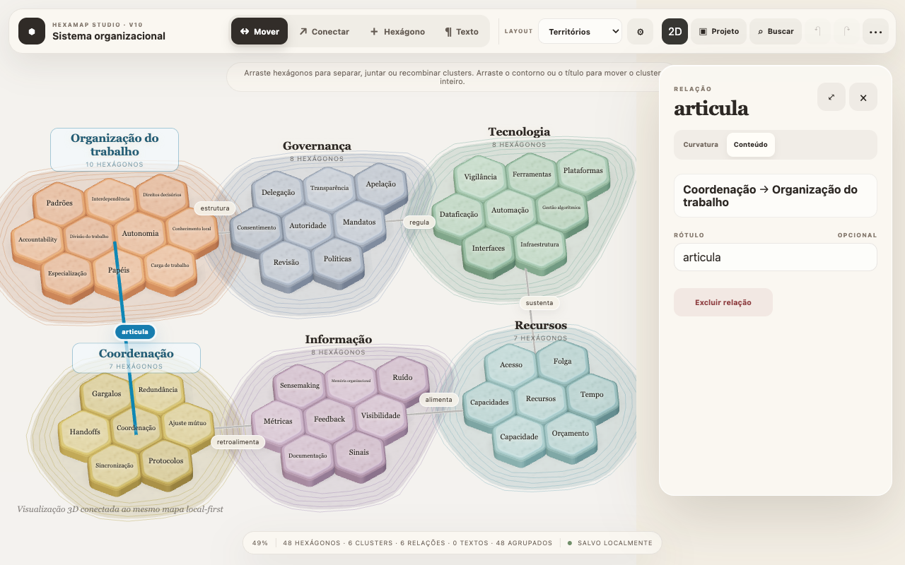

# HexaMap Studio

**Versão atual: 0.1.10 · beta pública · MIT**

[](https://github.com/dravisss/hexamap/actions/workflows/ci.yml)
[](https://github.com/dravisss/hexamap/actions/workflows/release.yml)

O HexaMap é uma ferramenta **local-first de mapeamento hexagonal**. Ela transforma
notas Markdown em um mapa visual para **organizar, decompor, recombinar,
relacionar e aprofundar informação** numa única superfície de trabalho.

Cada elemento tem uma função simples:

- **hexágono** = uma ideia, nota ou unidade de informação;
- **cluster** = um território semântico que agrupa hexágonos;
- **relação** = uma conexão direcionada entre territórios ou ideias;
- **anotação** = título, hipótese, legenda ou explicação livre no canvas;
- **drawer** = o lugar para ler e editar o conteúdo Markdown completo.

O conteúdo continua sendo um conjunto de arquivos Markdown. O mapa é uma
projeção editável desse conteúdo: o texto fica nas notas, enquanto posições,
relações, leituras e aparência ficam no manifesto `.hexmap/map.json` e em
`.hexmap/views/`.

```text
notas/*.md + frontmatter YAML
          │
          ▼
HexaMap: mapa, clusters, relações e leituras
          │
          ├── browser local / preview-inline.html
          ├── CLI headless e JSON Schema
          ├── MCP stdio para qualquer agente
          └── bundle Markdown + layout portátil
```

Isso torna o projeto útil para qualquer agente que saiba ler e escrever
arquivos: um agente pode produzir notas, validar um mapa, compor um layout,
auditar a renderização ou operar o MCP sem conta, banco, cloud ou backend
remoto obrigatório.

A interface mantém a superfície simples — um canvas, hexágonos, clusters e
setas — e acrescenta recursos progressivos baseados em Markdown, YAML e
arquivos portáteis:

- routing automático consciente de obstáculos;
- ajuste manual e assistido de curvas;
- títulos editoriais de clusters;
- Markdown e leitura em tela inteira;
- campos customizados e tags;
- imagens dentro dos hexágonos;
- layout livre e eixos X/Y;
- texto livre no canvas;
- importação e exportação JSON completa;
- projetos locais em pastas com Markdown e frontmatter YAML;
- busca por título, conteúdo, tags e campos;
- pacote instalável, CLI headless, JSON Schemas, quatro Agent Skills e MCP stdio para operação portátil entre harnesses.

O projeto não exige banco, conta, cloud ou backend remoto. O conteúdo continua
em arquivos que podem ser versionados e lidos sem o HexMap.

## Veja o HexaMap

Uma visão geral do mapa de exemplo:



O mesmo conteúdo pode ser lido em foco, sem perder os campos estruturados:



Relações têm conteúdo próprio e roteamento automático ou assistido:



A busca atravessa hexágonos, clusters, relações e anotações:



O renderer 3D preserva o mesmo contexto editorial do mapa 2D:



## Primeiros cinco minutos

### Abrir sem instalar

Abra [`preview-inline.html`](preview-inline.html) diretamente no navegador. É
um preview autocontido, sem CDN e sem servidor.

### Rodar localmente

```bash
git clone https://github.com/dravisss/hexamap hexamap
cd hexamap
python3 server.py
```

Depois acesse `http://127.0.0.1:8123` ou abra `start.command` no macOS.

### Testar com um mapa de exemplo

```bash
python3 hexmap_cli.py validate examples/minimal-map.json
python3 hexmap_cli.py audit examples/organizational-system.json
```

Para um workspace Markdown, abra `examples/workspace/` no editor ou execute:

```bash
python3 hexmap_cli.py render examples/workspace -o /tmp/hexamap-preview.html
```

## Instalação rápida

### PyPI

```bash
python -m venv .venv
source .venv/bin/activate       # Windows: .venv\Scripts\activate
python -m pip install hexmap-studio==0.1.10
hexmap doctor --json
```

### Fonte / GitHub

Clone uma tag ou SHA do repositório e execute `python -m pip install .`. Para
um uso sem Python, baixe o `hexmap-studio-0.1.10-standalone.zip`, confirme o
SHA-256 em `SHA256SUMS.txt` e abra `preview-inline.html`.

O procedimento completo, incluindo clean install e rebuild reproduzível, está
em [`docs/INSTALLATION.md`](docs/INSTALLATION.md) e [`docs/RELEASE.md`](docs/RELEASE.md).

## Abrir

### Versão autocontida

Abra diretamente:

```text
preview-inline.html
```

Não depende de CDN nem de servidor.

### Servidor local

```bash
cd hexamap
python3 server.py
```

Depois acesse:

```text
http://127.0.0.1:8123
```

No macOS, também é possível abrir `start.command`.

## Interface principal

Há uma única interface de mapa e quatro ferramentas:

```text
Mover · Conectar · Hexágono · Texto
```

Não existem modos conceituais separados de “cartografia”, “biblioteca” ou “fluxos”. O mapa continua sendo uma única superfície. Conteúdo profundo, relações e templates aparecem progressivamente conforme a necessidade.

### Mover

- arrasta um hexágono com snap na grade axial;
- separar uma célula pode decompor o cluster;
- encostar células pode formar ou recombinar clusters;
- arrastar o título ou o contorno move o cluster inteiro;
- `Shift + clique` produz seleção múltipla;
- uma seleção pode ser compactada num novo cluster.

### Conectar

- selecione o cluster de origem e o cluster de destino;
- a relação recebe uma curva automática;
- clicar na seta abre o editor de conteúdo e roteamento;
- arrastar o handle altera a curva manualmente.

### Hexágono

- clique no canvas para criar uma nova unidade de informação;
- edite título, resumo, Markdown, tags, campos e aparência no drawer.

### Texto

- clique em qualquer área vazia do canvas;
- escreva uma anotação em Markdown;
- arraste e redimensione a anotação;
- use como título, hipótese, explicação, legenda ou callout.

## Routing automático das setas

O router não escolhe apenas um arco arbitrário. Para cada relação, ele:

1. encontra pontos de saída e entrada nas bordas dos clusters;
2. gera candidatos dos dois lados da relação;
3. varia curvatura lateral e avanço angular;
4. penaliza trajetórias que entram no cluster de origem pelo lado errado;
5. penaliza trajetórias que chegam ao destino pelo exterior incorreto;
6. evita hulls, títulos e outras rotas;
7. prefere corredores externos quando duas opções são equivalentes;
8. seleciona a curva de menor custo.

Modos disponíveis:

```text
AUTO       recalcula sem intervenção
ASSISTIDO  preserva a preferência editorial do usuário
MANUAL     preserva o controle salvo
```

No drawer da relação há dois sliders:

- **curvatura lateral**;
- **ângulo / avanço do controle**.

Também é possível:

- arrastar o handle diretamente no canvas;
- inverter o lado da curva;
- recalcular automaticamente.

Mais detalhes em `ROUTING.md`.

## Títulos editoriais de clusters

Os pequenos cards da V8 foram substituídos por labels editoriais:

```text
CLUSTER
Organização do trabalho
10 hexágonos
```

O sistema testa posições em torno do hull e procura uma área que não cubra células, títulos ou relações. O título continua arrastável; offsets manuais são persistidos no JSON.

## Drawer de conhecimento

O drawer possui três escalas:

```text
PEEK   inspeção rápida
WIDE   edição confortável
FOCUS  leitura em tela inteira
```

### Conteúdo

- título;
- resumo;
- corpo Markdown;
- editor, preview e modo dividido;
- leitura editorial em tela cheia.

O renderer Markdown suporta:

- headings;
- listas;
- blockquotes;
- links HTTP/HTTPS;
- code blocks;
- bold, italic e strikethrough.

HTML bruto é escapado antes da interpretação.

### Campos

O mapa mantém um registry compartilhado de propriedades. Tipos disponíveis:

```text
texto curto
texto longo
Markdown
número
data
boolean
select
multi-select
URL
cor
imagem
```

### Aparência

Um hexágono pode usar:

```text
TEXT   somente texto
ICON   imagem/ícone + texto
COVER  imagem de fundo + texto
IMAGE  somente imagem
```

Imagens podem vir de URL, arquivo local ou data URI. Uploads são incorporados ao JSON como data URI, permitindo exportação autocontida.

### Relações

No drawer de hexágono aparecem cluster, coordenadas, vizinhança e operações de decomposição. No drawer de cluster aparecem composição, entradas, saídas e ações de desmontagem ou conexão.

## Modos de leitura

### Territórios

- hexágonos usam coordenadas axiais `q/r`;
- pertencimento a clusters é semântico e não depende de encostar fisicamente;
- contornos podem ser mostrados ou ocultados sem apagar os clusters;
- posição, viewport e offsets editoriais são salvos.

### Mosaico

- hexágonos podem formar um tiling contínuo, inclusive entre clusters diferentes;
- a ferramenta Conectar cria caminhos por borda entre vizinhos;
- curvas continuam disponíveis para relações não adjacentes ou entre clusters;
- proximidade visual nunca muda o pertencimento por conta própria.

### Eixos X/Y

O usuário define:

- nome e domínio do eixo X;
- nome e domínio do eixo Y.

Cada hexágono possui `axisPosition.x/y` normalizado entre 0 e 1. Arrastar no canvas atualiza simultaneamente:

- a posição visual;
- os valores semânticos dos campos `time` e `energy`, quando presentes.

Os clusters não desenham hulls gigantes atravessando o gráfico. As cores de cluster permanecem nas células e uma chave editorial aparece acima dos eixos.

## Campos, tags, cores e agrupamento

Em **Configuração do mapa → Estilo** é possível:

- colorir por campo customizado;
- colorir pela primeira tag;
- alterar as cores geradas;
- formar clusters a partir de um campo;
- formar clusters a partir da primeira tag.

O agrupamento por campo reorganiza a composição, mas o JSON continua contendo o conteúdo completo de cada hexágono.

## Persistência e JSON

### Workspace local-first

O HexaMap pode abrir uma pasta comum como projeto. Cada hexágono é projetado a partir de um arquivo Markdown comum; frontmatter YAML enriquece a nota, mas não é obrigatório. Layout e relações ficam separados em `.hexmap/map.json`.

Wikilinks podem ser importados opcionalmente como relações entre hexágonos. Um
mesmo corpus pode ter várias **leituras**: cada uma guarda somente posições,
relações e aparência em `.hexmap/views/`, sem copiar o conteúdo Markdown.

```text
Meu Projeto/
├── hexmap.yaml
├── notas/*.md
├── assets/
└── .hexmap/map.json
```

Use **Projeto → Abrir pasta** para ler e gravar diretamente em browsers compatíveis. **Importar bundle** e **Exportar bundle** oferecem o mesmo contrato sem exigir permissão de diretório. Veja `WORKSPACE.md` e `examples/workspace/`.

Não há banco de dados, login ou servidor remoto. O JSON completo anterior continua disponível para automação e compatibilidade.

### Sessão e JSON legado

A aplicação salva localmente no navegador quando `localStorage` está disponível.

O botão de exportação produz um JSON com:

- metadata do mapa;
- viewport;
- layout;
- definições de campos;
- regras de estilo;
- conteúdo Markdown;
- tags e valores customizados;
- modo visual e imagens;
- coordenadas de todos os hexágonos;
- clusters e offsets de títulos;
- relações e configuração de routing;
- textos livres no canvas.

O contrato está em:

```text
schemas/hexmap.schema.json
```

Exemplos válidos:

```text
examples/organizational-system.json
examples/minimal-map.json
examples/axes-map.json
```

## CLI

```bash
python3 hexmap_cli.py --help
```

Comandos:

```bash
hexmap init
hexmap validate
hexmap normalize
hexmap audit
hexmap layout
hexmap route
```

Exemplos:

```bash
python3 hexmap_cli.py validate examples/minimal-map.json

python3 hexmap_cli.py audit examples/organizational-system.json

python3 hexmap_cli.py layout examples/minimal-map.json \
  --template free -o /tmp/map-laid-out.json

python3 hexmap_cli.py layout examples/axes-map.json \
  --template axes --x-field time --y-field energy \
  -o /tmp/axes.json

python3 hexmap_cli.py route examples/minimal-map.json \
  -o /tmp/routes-auto.json
```

## Skills para agentes

As quatro skills são instruções portáteis em Markdown acompanhadas de scripts
Python pequenos. Elas não dependem de um modelo, provedor ou banco específico;
podem ser usadas por qualquer agente capaz de seguir um contrato de arquivos e
comandos.

| Skill | Use quando você precisa de… | Entrada típica | Resultado |
| --- | --- | --- | --- |
| [`build-hexamap`](skills/build-hexamap/SKILL.md) | transformar material bruto em um mapa semântico | prompt, notas ou corpus Markdown | hexágonos, clusters, relações, campos, tags e anotações |
| [`compose-hexamap`](skills/compose-hexamap/SKILL.md) | escolher uma leitura e dar forma ao mapa | mapa JSON ou workspace | honeycomb, layout livre/eixos, cores, imagens, títulos e routing |
| [`audit-hexamap`](skills/audit-hexamap/SKILL.md) | verificar qualidade estrutural, visual e de interação | mapa, bundle ou workspace | diagnósticos, contraprovas, screenshots e veredito |
| [`orchestrate-hexamap`](skills/orchestrate-hexamap/SKILL.md) | executar o ciclo completo de ponta a ponta | corpus Markdown + objetivo | workspace, composição, render, QA e bundle portátil |

Um fluxo de agente comum é:

```text
build → compose → audit → orchestrate/publicar
```

```text
skills/build-hexmap
skills/compose-hexmap
skills/audit-hexmap
skills/orchestrate-hexmap
```

### `build-hexmap`

Use esta skill para transformar material bruto em entidades, clusters, relações, campos, tags, Markdown e anotações.

### `compose-hexmap`

Use esta skill para aplicar honeycombs, layout livre ou por eixos, imagens, cores, títulos editoriais e routing.

### `audit-hexmap`

Use esta skill para validar schema, rodar auditoria estrutural, renderizar em Chromium, criticar o resultado e repetir o ciclo de refinamento.

### `orchestrate-hexmap`

Use esta skill para executar o ciclo completo de workspace Markdown, composição, render, screenshots, QA e bundle portátil.

Leia [`LLM_INTEGRATION.md`](LLM_INTEGRATION.md) para o fluxo completo.

## Estrutura do pacote

```text
hexamap/
├── index.html
├── preview-inline.html
├── styles.css
├── app.js
├── data.js
├── hex.js
├── router.js
├── markdown.js
├── schemas/
│   └── hexmap.schema.json
├── examples/
├── assets/
├── skills/
│   ├── build-hexmap/
│   ├── compose-hexmap/
│   ├── audit-hexmap/
│   └── orchestrate-hexmap/
├── hexmap_cli.py
├── tests/
├── previews/
├── ARCHITECTURE.md
├── ROUTING.md
├── LLM_INTEGRATION.md
├── AUDIT_LOOP.md
└── VALIDATION.md
```

## Atalhos

| Atalho | Ação |
|---|---|
| `V` | Mover |
| `C` | Conectar |
| `H` | Novo hexágono |
| `T` | Texto livre |
| `0` | Ajustar mapa |
| `Esc` | Limpar seleção / cancelar |
| `Ctrl/Cmd + Z` | Desfazer |
| `Ctrl/Cmd + Shift + Z` | Refazer |
| `Delete` | Excluir seleção compatível |

## Validação

```bash
python3 browser_smoke.py
python3 validate_package.py
```

Para obrigar o validador a refazer o browser smoke internamente:

```bash
HEXMAP_RUN_BROWSER=1 python3 validate_package.py
```

O validador executa ou verifica:

- sintaxe JavaScript;
- testes unitários;
- compilação Python;
- JSON Schema e auditoria dos exemplos;
- validação das quatro skills;
- build inline;
- relatório fresco do smoke test no Chromium;
- verificação das evidências visuais.

## Limites atuais

- desktop-first;
- relações direcionadas conectam clusters, não células individuais;
- o router é um solver por candidatos quadráticos, não um pathfinder multi-segmento completo;
- agrupamento por campo é aplicado como transformação, não sincronização contínua;
- imagens incorporadas aumentam o tamanho do JSON;
- não há backend, autenticação ou colaboração em tempo real;
- acessibilidade por teclado ainda não cobre todas as operações espaciais;
- mapas com milhares de células exigirão virtualização ou renderer acelerado.

## Compatibilidade, privacidade e segurança

Chromium 120+, Firefox 121+ e Safari 17+ são a matriz suportada para a série
0.1. A seleção de pasta depende das permissões e APIs do navegador; bundles
JSON permanecem o fallback portátil. Consulte
[`docs/BROWSER-COMPATIBILITY.md`](docs/BROWSER-COMPATIBILITY.md).

Os dados ficam locais: não há telemetria, login, banco ou sincronização
obrigatória. O modelo de ameaças, limites de entrada, headers do servidor e
reporte responsável estão em [`docs/PRIVACY.md`](docs/PRIVACY.md) e
[`SECURITY.md`](SECURITY.md).

Para contribuir, leia [`CONTRIBUTING.md`](CONTRIBUTING.md). Mudanças públicas
e incompatibilidades são registradas em [`CHANGELOG.md`](CHANGELOG.md).
